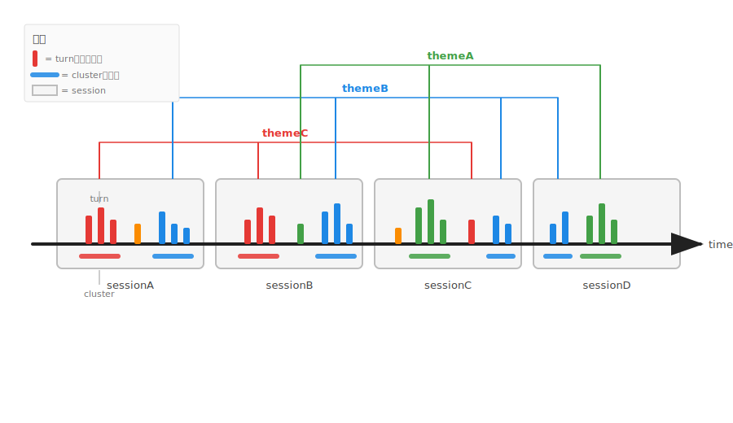

# Kimi Code Memory MCP Server

[English](./README.en.md)

[](https://github.com/Zehee/kimi-code-memory-mcp-server/actions/workflows/ci.yml)
[](https://www.npmjs.com/package/kimi-code-memory-mcp-server)
[](./LICENSE)

一个为 [Kimi Code CLI](https://github.com/MoonshotAI/kimi-code) 提供跨会话记忆的本地 stdio MCP 服务器。

> **注意：** 本包已发布到 npm，包名为 `kimi-code-memory-mcp-server`。你可以直接安装，也可以从源码运行。


## 特性

- **Markdown 优先的记忆** —— 人类可读、适合 git、兼容 LLM。
- **结构化长期记忆** —— `memory/decisions/`、`memory/knowledge/`、`memory/rules/`、`memory/reference/`。
- **工作区精要** —— 从 `memory/` 提炼生成的浓缩摘要（≤15 KB）。
- **跨会话上下文恢复** —— 直接解析 Kimi Code CLI 的 `wire.jsonl`。
- **主题追溯** —— 将对话轮次和记忆关联到主题，并追踪其演化。
- **精炼轮次摘要** —— 可在多个主题间共享的轮次级原子摘要。
- **可重建索引** —— `index.json` 只是缓存，`.md` 文件才是真相来源。

## 主题追溯

传统的上下文管理只关注**纵向**：时间越近越清晰，越久越远越衰减。但这忽略了真实工作的一个核心特征：

> **同一个 workspace 中的多次会话，往往不是单一叙事，而是多条主题线交织并行。**

例如：

- Session A：开发 auth 鉴权
- Session B：讨论orders数据表的迁移问题
- Session C：加密RSA+解密BCrypt+验证码CAPTCHA+Cookie 
- Session D：fix sql  error bug
- Session E： 登录Login API设计

如果只看纵向，这些 session 彼此独立。但如果横向扫描，会发现 A、C、E 都属于"注册登录"这一主题。

**主题追溯**就是：把时间线上的每个 turn 看作一个圆柱，圆柱的高度代表该 turn 的计算/思考深度，颜色/标签代表主题。我们甚至可以从kimi code已经压缩归档的上下文中再次挖掘，进行深度横向扫描，把同色圆柱（对话轮turns）找出来，重新建立关联，组成theme并存入记忆。
>下图展示了 `kimi-memory` 如何看待对话历史：竖条是时间轴上的 turn，粗横线是簇，灰框是 session，彩色括号把跨 session 的相关 turns / clusters 串联成主题线。



下面是一段真实的 Kimi Code CLI 会话动图，使用 `kimi-memory`。用户先后要求总结 MCP 记忆服务器的演进历史、以及 E2E 测试工具的演进历史；Agent 跨会话召回相关记忆与对话 turns，并生成结构化总结。


相关工具：`tag_theme`、`trace_theme`、`list_themes`、`search_context`、`refine_session_turns`、`load_turn_context`。

## 为什么用 Markdown？

大多数 Agent 记忆系统默认使用向量数据库。这在模糊检索场景有效，但也让记忆变得不透明、难以审计、难以版本控制。

本项目从相反的假设出发：

> 记忆在存储之前应该经过**判断、结构化，并由用户拥有**。

Markdown + YAML frontmatter 带来：

- 完全可读、可编辑
- 原生支持 git diff
- 无需外部数据库或云服务
- 兼容任何能读取文本的 LLM

设计 rationale 见 [`docs/ARCHITECTURE.md`](./docs/ARCHITECTURE.md)。

## 安装

需要 Node.js ≥ 18。

### 从 npm 安装（推荐）

```bash
npm install -g kimi-code-memory-mcp-server
```

### 从源码安装

```bash
git clone https://github.com/Zehee/kimi-code-memory-mcp-server.git
cd kimi-code-memory-mcp-server
npm install
npm run build
```

## 快速配置（推荐）

从 npm 安装后，运行 setup 命令自动配置 Kimi Code CLI：

```bash
npx kimi-memory-setup
```

它会完成：

1. 检测 `~/.kimi-code` 目录。
2. 在 `~/.kimi-code/AGENTS.md` 顶部注入记忆协议规则。
3. 将 `memory-manage` Skill 安装到 `~/.kimi-code/skills/memory-manage`。
4. 在 `~/.kimi-code/mcp.json` 中添加 `kimi-memory` MCP 服务器配置。

预览变更而不写入文件：

```bash
npx kimi-memory-setup --dry-run
```

后续如需移除注入的配置：

```bash
npx kimi-memory-setup --undo
```

## 配置 Kimi Code CLI（手动）

如果你希望手动配置，编辑 `~/.kimi-code/mcp.json` 并添加服务器。

如果你用 `npm install -g` 安装，使用全局 `node_modules` 中 `dist/server.js` 的绝对路径：

```json
{
  "mcpServers": {
    "kimi-memory": {
      "command": "node",
      "args": ["/absolute/path/to/global/node_modules/kimi-code-memory-mcp-server/dist/server.js"],
      "enabled": true
    }
  }
}
```

或者直接通过 `npx` 运行（无需安装）：

```json
{
  "mcpServers": {
    "kimi-memory": {
      "command": "npx",
      "args": ["-y", "kimi-code-memory-mcp-server"],
      "enabled": true
    }
  }
}
```

如果你从源码构建，指向本地 `dist/server.js`：

```json
{
  "mcpServers": {
    "kimi-memory": {
      "command": "node",
      "args": ["/absolute/path/to/kimi-code-memory-mcp-server/dist/server.js"],
      "enabled": true
    }
  }
}
```

服务器名称 **`kimi-memory`** 很重要，因为本仓库自带的 `AGENTS.md` 规则以 `mcp__kimi-memory__*` 形式调用工具（例如 `mcp__kimi-memory__bootstrap_workspace`）。

重启 Kimi Code CLI 以加载该服务器。

## 可选：安装用户级 AGENTS.md 启动钩子

如需每次会话启动时自动恢复记忆并应用行为规范，将本仓库自带的 `AGENTS.md` 复制到 Kimi Code 用户目录：

```bash
cp AGENTS.md ~/.kimi-code/AGENTS.md
```

这会安装一个启动钩子，让 Kimi Code CLI 在每次会话开始时调用 `bootstrap_workspace`，并遵循记忆分类和决策守卫规则。由于 `AGENTS.md` 会注入到**每个**会话中，它是放置记忆相关行为协议的正确位置。

> **注意：** `AGENTS.md` 规则会注入到每个会话中，请只保留与记忆相关的约定，不要包含属于其他 MCP server 的工具偏好。
>
> **前提条件：** 必须在 `~/.kimi-code/mcp.json` 中将 MCP 服务器注册为 `kimi-memory`，否则 `AGENTS.md` 中的 `mcp__kimi-memory__*` 调用会失败。

## 可选：安装记忆 Skill

本仓库还包含一个轻量 Skill（`skills/memory-manage/SKILL.md`），用于在用户表达记忆相关意图时提醒 Kimi Code CLI 调用记忆工具。

```bash
cp -r skills/memory-manage ~/.kimi-code/skills/memory-manage
```

该 Skill 本身**不强制**行为，它只是一个调度器。真正的协议（何时 remember、决策守卫等）应配置在 `AGENTS.md` 中。

## 快速开始

服务器加载后，Agent 可以自然地调用记忆工具（工具名带有你在 MCP 配置中注册的 server 名称前缀，例如 `mcp__kimi-memory__*`）：

```text
用户：我们用 SQLite 作为缓存层。
Agent：[调用 mcp__kimi-memory__remember] key=use-sqlite-cache, folder=memory/decisions

用户：为什么选 SQLite？
Agent：[调用 mcp__kimi-memory__search] query=SQLite cache decision
       [调用 mcp__kimi-memory__recall] key=use-sqlite-cache, folder=memory/decisions
       → "我们选择 SQLite 而不是 Redis，因为……"

用户：缓存设计是怎么演化的？
Agent：[调用 mcp__kimi-memory__tag_theme] theme=cache-design
       [调用 mcp__kimi-memory__trace_theme] theme=cache-design
       → 展示跨会话的相关轮次和决策
```

## 存储布局

服务器将数据存储在 `~/.kimi-code-memory/<workspace-id>/` 下：

```text
~/.kimi-code-memory/workspace-a1b2c3d4/
├── index.json              # v3-kv 元数据缓存（可重建）
├── memory/
│   ├── decisions/          # 架构与产品决策
│   ├── knowledge/          # 项目相关知识
│   ├── rules/              # 约定与红线
│   └── reference/          # 外部参考
├── essence/
│   └── essence.md          # 工作区精要（≤15 KB）
├── notes/                  # 临时速记
├── themes/
│   └── my-theme.json       # theme -> turn/memory 引用
└── refined/
    └── refined.sqlite      # 轮次级摘要
```

可通过 `MEMORY_STORE_ROOT` 环境变量覆盖存储根目录。

### 环境变量

| 变量 | 用途 |
|------|------|
| `MEMORY_STORE_ROOT` | 覆盖默认存储根目录 `~/.kimi-code-memory`。 |
| `MEMORY_SESSIONS_ROOT` | 覆盖默认的 `~/.kimi-code/sessions` 路径，用于发现 `wire.jsonl` 文件。 |
| `KIMI_CODE_HOME` | `MEMORY_SESSIONS_ROOT` 的替代方案；会话从 `<KIMI_CODE_HOME>/sessions` 读取。 |

## 工具列表

| 工具 | 用途 |
|------|------|
| `remember` | 写入一条 Markdown 记忆 |
| `recall` | 按 key 读取记忆 |
| `recall_recent` | 列出最近更新的记忆 |
| `search` | 在记忆中关键词搜索 |
| `list` | 列出记忆 |
| `list_tags` | 列出所有标签 |
| `delete` | 删除记忆 |
| `move` | 移动或重命名记忆 |
| `organize_memories` | 将 `memory/` 提炼为 `essence/essence.md` |
| `sync_workspace_index` | 从磁盘重建 `index.json` |
| `bootstrap_workspace` | 加载上下文、精要和记忆树 |
| `load_workspace_context` | 加载最近对话上下文 |
| `load_more_context` | 加载更早的对话轮次 |
| `search_context` | 跨所有会话 wire 搜索 |
| `load_turn_context` | 加载指定轮次详情 |
| `tag_theme` | 将轮次或记忆关联到主题 |
| `trace_theme` | 追溯主题演化 |
| `list_themes` | 列出主题 |
| `refine_session_turns` | 生成精炼轮次摘要 |

## 开发

```bash
git clone https://github.com/Zehee/kimi-code-memory-mcp-server.git
cd kimi-code-memory-mcp-server
npm install
npm run build
npm test
npm run lint
```

贡献指南见 [`docs/CONTRIBUTING.md`](./docs/CONTRIBUTING.zh-CN.md)。

## 项目结构

```text
src/
├── server.ts              # MCP 服务器入口
├── config.ts              # 默认值与路径
├── theme-manager.ts       # 主题存储
├── refined-manager.ts     # 精炼轮次存储
├── dao/
│   ├── index.ts           # index.json DAO（v3-kv）
│   └── memory-store.ts    # Markdown 文件操作
├── context/
│   └── wire-context.ts    # wire.jsonl 解析
├── tools/
│   ├── index.ts           # 工具 schema 与分发
│   ├── memory-tools.ts    # 记忆增删改查
│   ├── context-tools.ts   # 上下文恢复
│   ├── theme-tools.ts     # 主题追溯
│   └── system-tools.ts    # 整理/同步/引导
└── utils/
    ├── frontmatter.ts
    ├── paths.ts
    └── validation.ts
```

## 路线图

- [x] 模块化源码结构
- [x] ESLint + Prettier
- [x] 基础集成测试
- [x] 上下文/主题工具核心测试覆盖
- [ ] 可选本地 embedding 搜索
- [ ] 可选 LLM 精炼轮次
- [ ] 可插拔 wire 格式适配器
- [ ] 内存使用 benchmark

## 相关文档

- [`docs/ARCHITECTURE.md`](./docs/ARCHITECTURE.md) —— 系统设计与数据流
- [`docs/three-layer-memory-model.zh-CN.md`](./docs/three-layer-memory-model.zh-CN.md) —— 本服务器背后的记忆模型理论
- [`docs/search-logic.zh-CN.md`](./docs/search-logic.zh-CN.md) —— `search` 与 `search_context` 的实现逻辑
- [`docs/CONTRIBUTING.zh-CN.md`](./docs/CONTRIBUTING.zh-CN.md) —— 如何贡献

## 许可证

MIT
