# 功能依赖与运行流程图

> 基于 `src/` 当前实现（`package.json` v0.2.0）梳理。所有图均为 Mermaid，在 GitHub / VS Code Markdown 预览中可直接渲染。
>
> 阅读约定：
>
> - 实线箭头 `A --> B`：同步依赖或同步调用（A 依赖 / 调用 B）。
> - 虚线箭头 `A -.-> B`：异步、按需（dynamic import）或跨进程（stdio / HTTP）交互。
> - `{storeRoot}` 指 `~/.kimi-code-memory/<workspaceId>/`，可用 `MEMORY_STORE_ROOT` 覆盖。
> - `{sessionsRoot}` 指 `~/.kimi-code/sessions/`，可用 `MEMORY_SESSIONS_ROOT` / `KIMI_CODE_HOME` 覆盖。
> - 图中 `.md` 文件是**真相来源**；`index.json`、`refined.sqlite` 均为**可重建缓存**。

---

## 1. 功能依赖

### 1.1 分层架构（依赖方向自上而下）

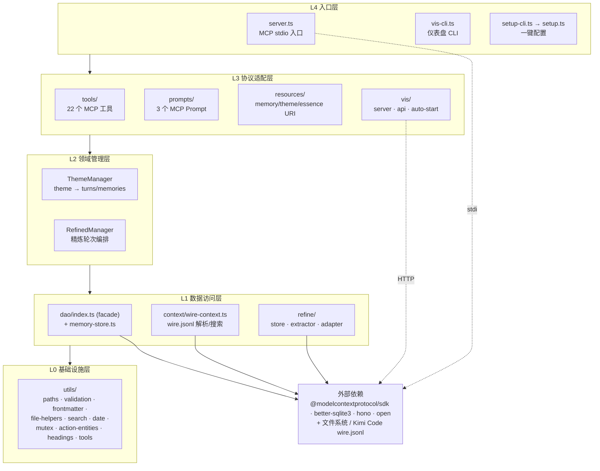

要点：

- 严格分层：上层只依赖下层，**不反向依赖**。`tools/` 不直接 `import` 具体存储细节，全部走 `Ctx` 注入的 `indexDao` / `memoryStore` / `themeManager` / `refinedManager`。
- `Ctx`（见 `src/types.ts`）是唯一的跨层上下文对象，由 `server.ts` 在启动期一次性装配，随后透传给 `createTools(ctx)` / `createResources(ctx)` / `vis`。
- `refined-manager` 与 `refine/` 是「门面 + 实现」关系：`RefinedManager` 保留对外 API 并持有写互斥锁，真正提取与持久化在 `refine/extractor.ts` 与 `refine/store.ts`。
- `dao/index.ts` 同样是 facade，内部拆成 `IndexStore` / `IndexReconciler` / `IndexCatalog` / `MemoryIndexTreeRenderer` 四个协作类（见 1.2）。

### 1.2 模块依赖关系（细化到文件 / 类）

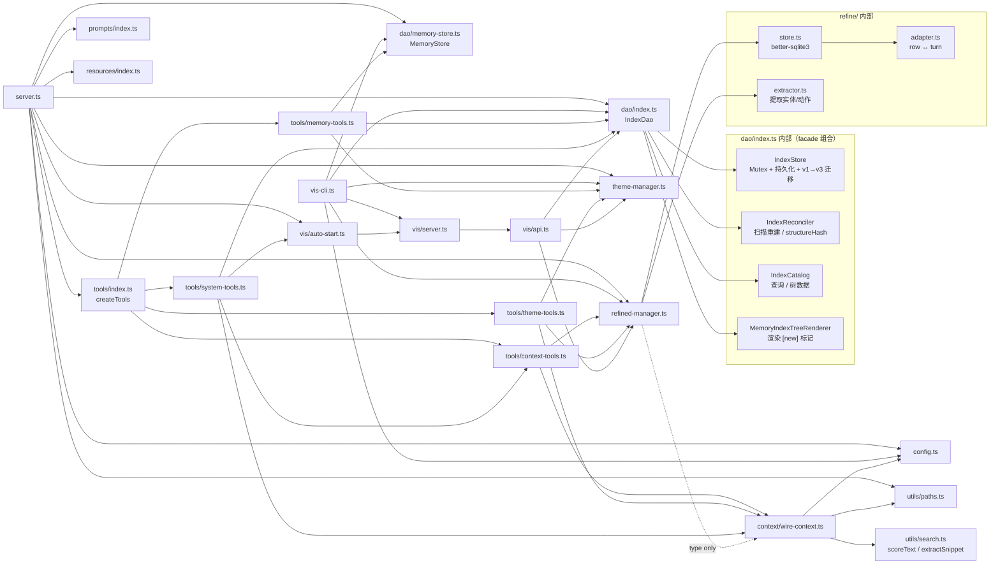

要点：

- `server.ts` 与 `vis-cli.ts` 都装配同一套 `Ctx`；区别只在传输层（stdio MCP vs. 独立 Hono HTTP）。
- `tools/system-tools.ts` 复用 `tools/context-tools.ts` 导出的 `buildWorkspaceContext`，避免 `bootstrap_workspace` 与 `load_workspace_context` 两份实现漂移。
- `dao/index.ts` 的所有写操作都通过 `IndexStore.runExclusive`（`utils/mutex.ts`）串行化，保证 `index.json` 读写互斥。
- `context/wire-context.ts` 仅在类型层面引用 `RefinedManager`（搜索时可合并已精炼结果），运行期由工具层注入实例，避免循环依赖。

### 1.3 MCP 工具 → 后端能力依赖

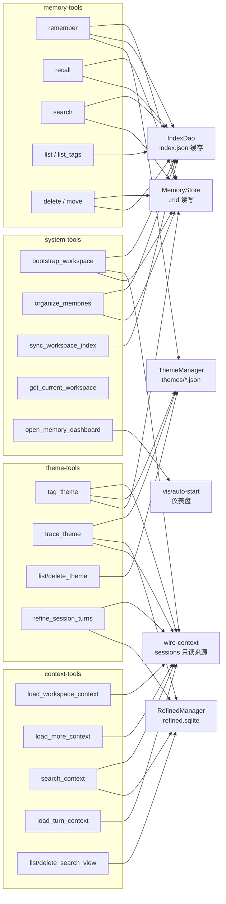

每个工具的具体后端触点在 **第 2 节运行流程** 中展开；下表是速查（✓ = 直接读 / 写该组件）：

| 工具 | MemoryStore | IndexDao | ThemeManager | RefinedManager | wire-context | vis |
|------|:-----------:|:--------:|:------------:|:--------------:|:------------:|:---:|
| remember | ✓ 写 | ✓ 写 | ✓ 可选 | | | |
| recall | ✓ 读 | ✓ 写 | | | | |
| search | ✓ 读（兜底） | ✓ 读 | | | | |
| list / list_tags | | ✓ 读 | | | | |
| delete / move | ✓ 写 | ✓ 写 | | | | |
| load_workspace_context | | | | | ✓ 读 | |
| load_more_context | | | | | ✓ 读 | |
| search_context | | | | ✓ 读/写 | ✓ 读 | |
| load_turn_context | | | | | ✓ 读 | |
| list/delete_search_view | | | | ✓ 删（可选级联） | | |
| tag_theme | ✓ 读 | | ✓ 写 | | ✓ 读 | |
| trace_theme | | | ✓ 读 | ✓ 读 | ✓ 读 | |
| list/delete_theme | | | ✓ 读/写 | | | |
| refine_session_turns | | | | ✓ 写 | ✓ 读 | |
| bootstrap_workspace | ✓ 读 | ✓ 写 | | | ✓ 读 | |
| organize_memories | ✓ 读/写 | ✓ 写 | | | | |
| sync_workspace_index | | ✓ 写 | | | | |
| get_current_workspace | | | | | | |
| open_memory_dashboard | | | | | | ✓ |

### 1.4 存储布局与数据所有权

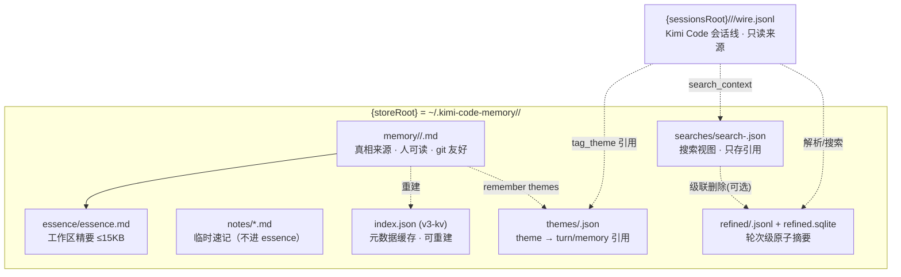

核心不变量：

- **`.md` 优先**：`index.json` 只是 `memory/`、`essence/`、`notes/` 的元数据缓存（title / tags / folder comment / structureHash）。任何不一致都可通过 `sync_workspace_index` 从文件系统重建。
- **`wire.jsonl` 只读**：本服务器从不改写 Kimi Code 的会话线（AGENTS.md 明令禁止）；`refined/`、`themes/`、`searches/` 只持有对 turn 的**引用**（`sessionId + turnId`），不复制正文。
- **主题与搜索视图只存引用**：删除 theme 或 search view 不会删除被引用的 memory / refined turn；`delete_search_view` 仅在显式 `deleteRefinedTurns=true` 时才级联清理精炼轮次。

---

## 2. 运行流程

### 2.1 服务器启动（`server.ts`）

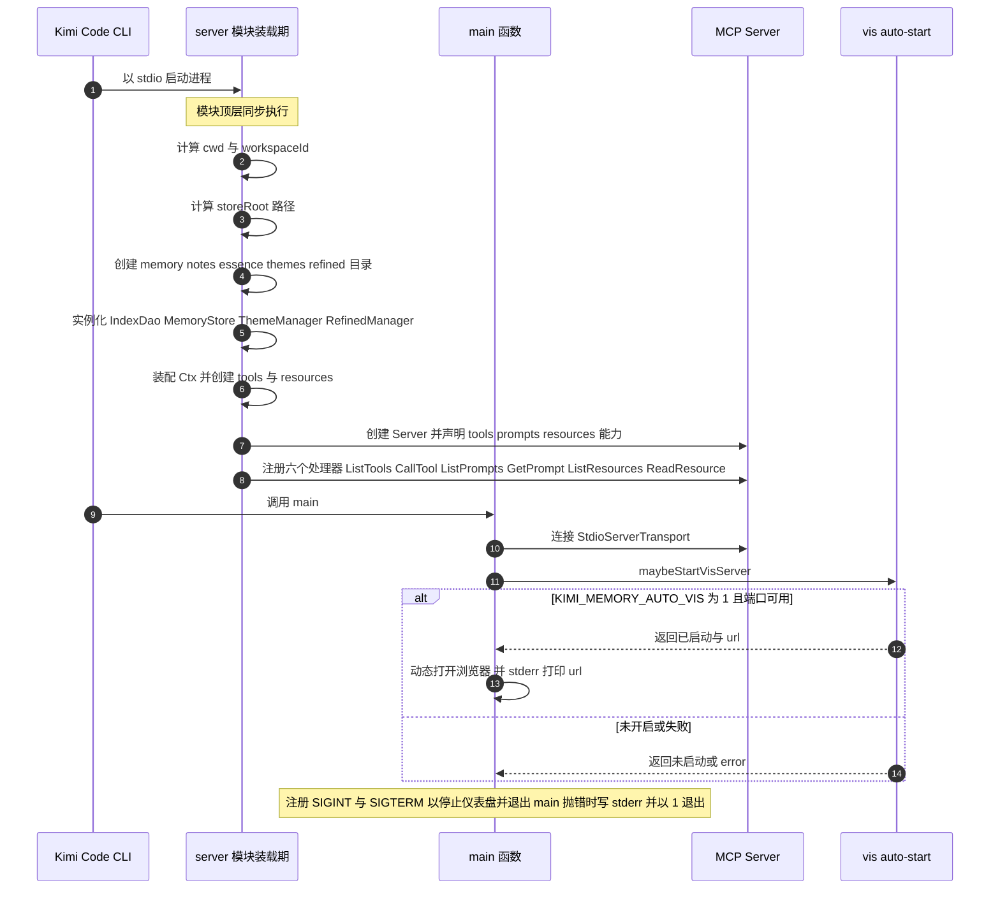

要点：

- 所有**可能失败或耗时的装配**（目录创建、DAO 构造、工具注册）都在模块顶层同步完成；进入 `main()` 时只剩「连接传输层 + 可选仪表盘」。
- `workspaceId` 由 `computeWorkspaceId(cwd)` 派生，保证同一工作区跨会话落到同一 `{storeRoot}`。
- MCP 能力声明同时打开 `tools` / `prompts` / `resources`；`resources.subscribe` 关闭（静态列表）。

### 2.2 MCP 工具调用分发（通用骨架）

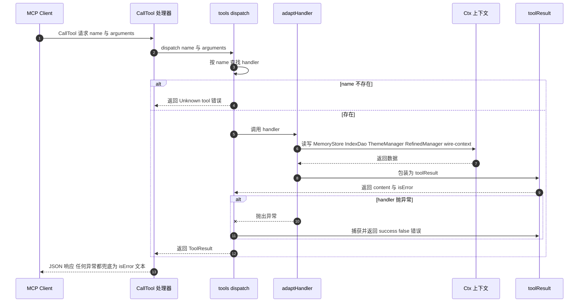

要点：

- 双层兜底：`dispatch` 内 `try/catch` 把 handler 异常变成 `{success:false,error}`；`server.ts` 外层再 `try/catch`，确保**任何工具异常都不会拖垮 stdio 连接**。
- `adaptHandler` 统一把 `args` 校验/返回包装成 MCP `content` 形态；handler 内部只返回普通对象，由 `toolResult` 序列化为 `JSON.stringify(..., null, 2)`。

### 2.3 `remember` 写记忆

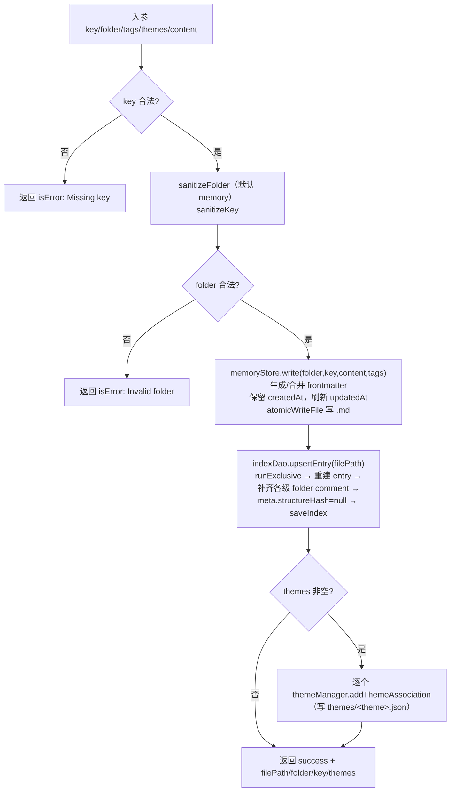

要点：

- 重写已存在 key 时，`MemoryStore.write` 会**保留原 `createdAt` 与 `title`、合并 `tags`**，仅刷新 `updatedAt`，避免覆盖式丢失元数据。
- `upsertEntry` 通过 `IndexStore.runExclusive` 串行化，并顺手为路径上每一级目录写入 folder entry（无 comment 时用 `FALLBACK_FOLDER_COMMENTS`）。

### 2.4 `recall` / `search` / `list` 读取路径

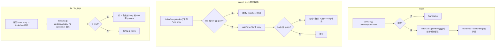

要点：

- `search` 走「**索引优先、正文兜底**」：先用 `index.json` 的 title/key 命中，未命中才回源读 `.md` body，兼顾速度与召回。
- `recall` 在读取时**反向刷新索引**（`upsertEntry`），使手工编辑过的 `.md` 也能在下次读取后回到缓存。

### 2.5 `bootstrap_workspace` 会话启动恢复

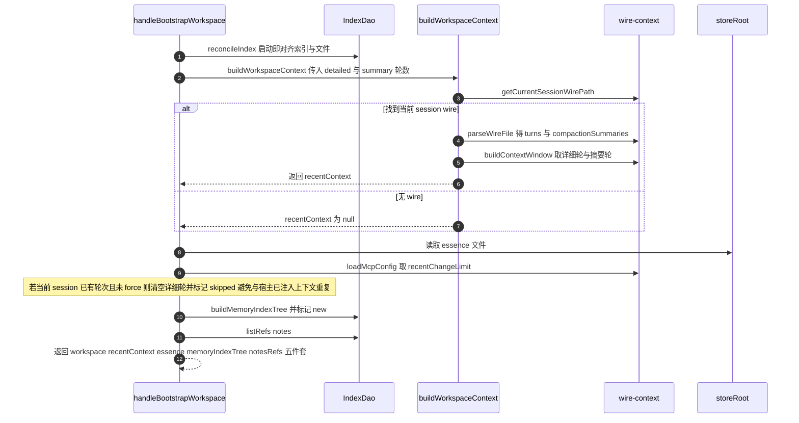

要点：

- 返回的「五件套」正好对应 AGENTS.md 启动协议要求内化的 `essence` / `memoryIndexTree` / `recentContext` / `notesRefs`。
- **去重保护**：当宿主（`kimi web` / `kimi -c`）已经把本会话轮次装进上下文时，`bootstrap_workspace` 默认不再回灌详细轮，除非 `force:true`。

### 2.6 `search_context` 跨会话搜索 + 聚簇 + 按需精炼（核心）

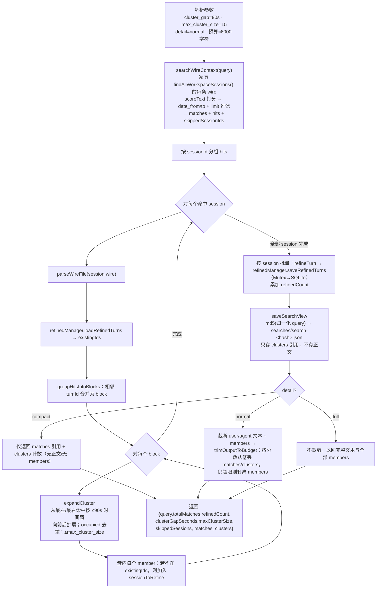

要点：

- **聚簇是 search_context 的灵魂**：相邻命中先并 block，再按时间窗（默认 90s）向两端扩张成「簇」，一簇代表一段连续讨论；`max_cluster_size`（默认 15）防止长讨论爆上下文。
- **按需精炼**：只精炼「簇内且尚未精炼」的 turn，并按 session 批量写库，避免反复保存；精炼结果后续可被 `trace_theme` / `load_turn_context` 复用。
- **预算保护**：normal 模式先把输出压到 `max_output_chars`（默认 6000），再不够就剥 members；`compact` 不返回正文，`full` 关闭预算。
- **搜索视图**以 query 的归一化 md5 命名，稳定可复用；它是后续 `tag_theme` 挂载候选集的来源（见 AGENTS.md 主题追溯流程）。

### 2.7 `tag_theme` / `trace_theme` 主题追溯

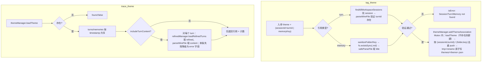

要点：

- `tag_theme` **强校验引用存在性**，杜绝把不存在的 turn/memory 挂进主题；AGENTS.md 进一步要求「内容 genuinely belongs to the theme」才挂载，禁止仅凭关键词。
- `trace_theme` 默认只返引用（轻量），需要正文时再 `includeTurnContent=true`，并优先用精炼摘要，缺失时回源 wire，单条失败不中断整体。

### 2.8 `refine_session_turns` 精炼轮次

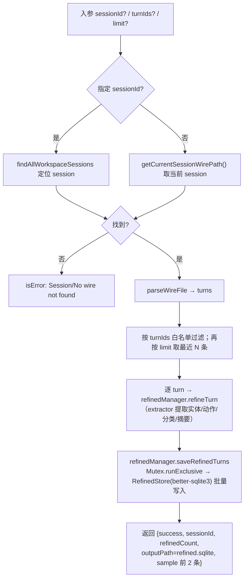

要点：

- `RefinedManager` 仅做编排与加锁；真正抽取在 `refine/extractor.ts`（动作实体 `utils/action-entities.ts`、分类 `utils/headings.ts`），行列映射在 `refine/adapter.ts`。
- 写入走 `Mutex.runExclusive`，与 `search_context` 的批量精炼、删除级联共享同一把锁，保证 SQLite 写互斥。

### 2.9 `organize_memories` 两阶段整理精要

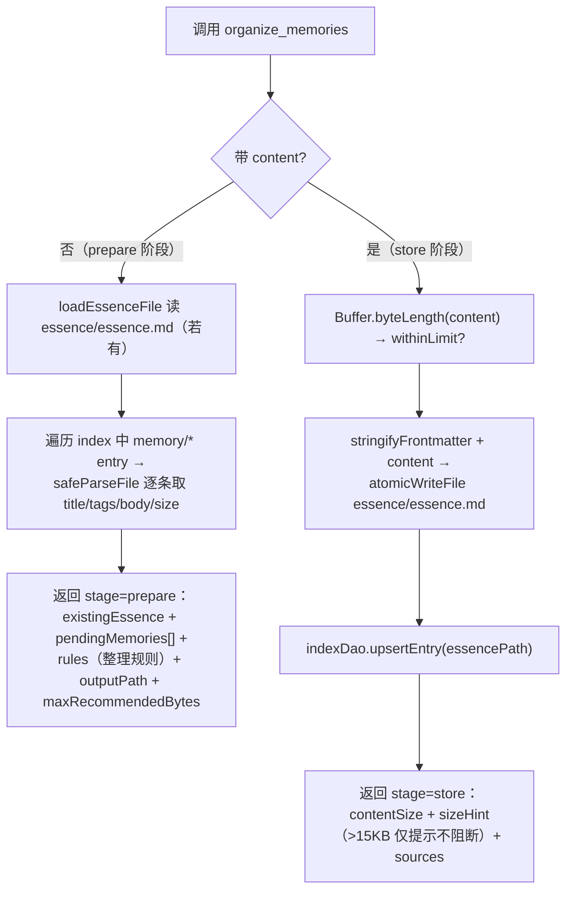

要点：

- 工具本身**不生成精要内容**：prepare 阶段把「旧精要 + 全部 memory 正文 + 整理规则」交给 Agent，由 Agent 完成归类/去重/排序/剔除后，再以 `content` 回调 store 阶段落盘。
- 规则要求关键结论用 `> 来源：memory/<folder>/key` 在行内标注；超过 15KB 只给 `sizeHint`，不阻止保存。

### 2.10 `sync_workspace_index` / `reconcileIndex` 索引重建

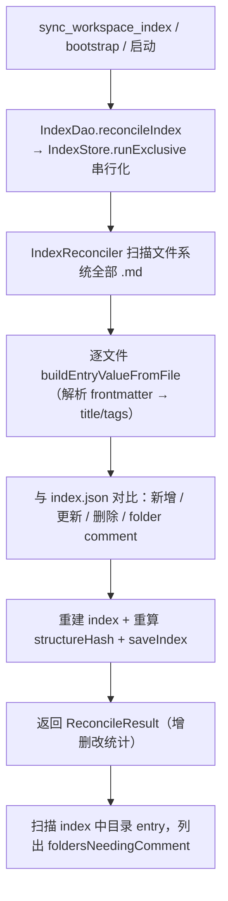

要点：

- `index.json` 是**可重建缓存**：真相永远在 `.md`。`reconcileIndex` 用 `structureHash` 快速判断结构是否变化，写操作（remember/move/delete/upsertEntry）会把 `structureHash` 置 `null` 触发下次重算。
- `folderComments` 入参可批量设置目录说明；缺失 comment 的目录会出现在 `foldersNeedingComment` 中提醒补齐。

### 2.11 可视化仪表盘启动

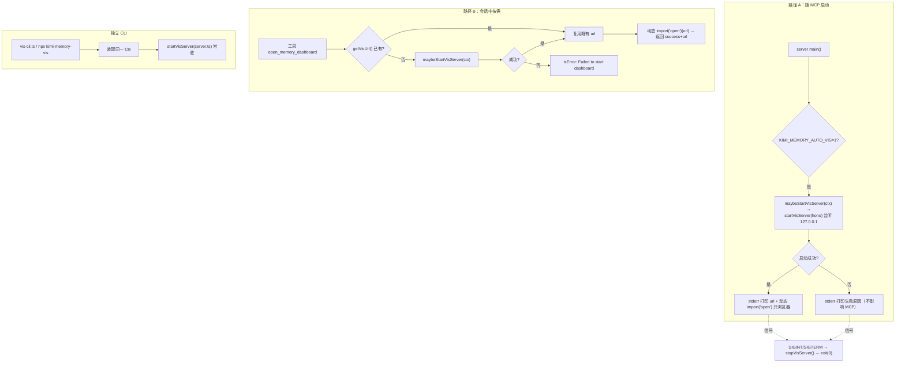

要点：

- 三条入口（随 MCP 自启 / 会话内工具 / 独立 CLI）共用 `vis/server.ts`（Hono）+ `vis/api.ts`（数据装配），读取同一 `{storeRoot}`。
- 仪表盘进程**与 MCP 进程解耦**：自启失败只写 stderr，不影响 stdio 工具通道；`open` 动态导入，无图形环境时静默忽略。

---

## 3. 速查：模块职责一句话

| 层 | 模块 | 职责 |
|----|------|------|
| L4 | `server.ts` | 装配 `Ctx`、注册 6 个 MCP handler、连接 stdio、可选自启仪表盘 |
| L4 | `vis-cli.ts` / `vis/server.ts` / `vis/api.ts` | 独立 Hono 仪表盘，复用 `Ctx` 读取 `{storeRoot}` |
| L4 | `setup.ts` / `setup-cli.ts` | 向 `~/.kimi-code` 注入 AGENTS.md 协议、Skill、`mcp.json` |
| L3 | `tools/*` | 22 个工具的 schema + handler + dispatch |
| L3 | `prompts/index.ts` | 3 个 MCP Prompt（决策检查 / 主题追溯 / 会话总结） |
| L3 | `resources/index.ts` | `memory://`、`theme://`、`essence://` 资源读取 |
| L2 | `theme-manager.ts` | `themes/<theme>.json` 关联存储（Mutex + 原子写） |
| L2 | `refined-manager.ts` | 精炼轮次编排 + 写互斥；门面 |
| L1 | `dao/index.ts` + 4 协作类 | `index.json` v3-kv 缓存的持久化/重建/查询/渲染 |
| L1 | `dao/memory-store.ts` | Markdown + frontmatter 读写移（safeResolve + atomicWriteFile） |
| L1 | `context/wire-context.ts` | 发现/解析/搜索 Kimi Code `wire.jsonl`，构建上下文窗口 |
| L1 | `refine/store.ts` / `extractor.ts` / `adapter.ts` | 精炼轮次的 SQLite 持久化、实体动作抽取、行列映射 |
| L0 | `utils/*` | 路径/校验/frontmatter/文件/搜索/日期/互斥锁等纯函数与工具 |

> 维护提示：新增工具时，在对应 `tools/*-tools.ts` 增加 `ToolDefinition` 即可被 `tools/index.ts` 自动聚合；新增持久化只读来源时优先复用 `wire-context` / `dao`，新增可变状态务必走现有 `Mutex` / `runExclusive` 路径，避免与 `index.json`、`refined.sqlite`、`themes/*.json` 的并发写冲突。
