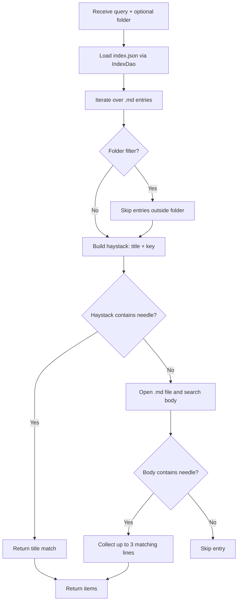
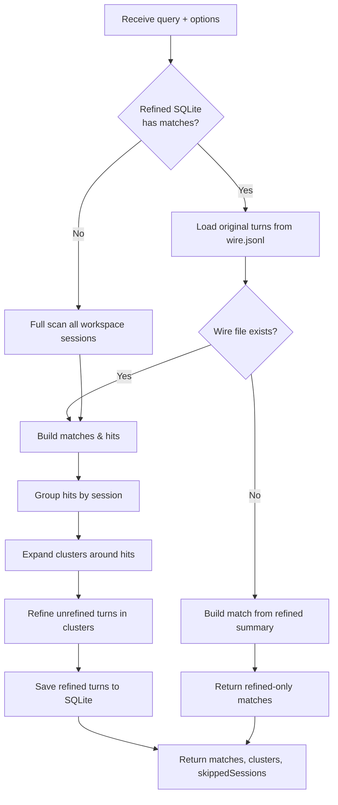

# Search Logic

The project provides two search tools with different scopes and implementations:

- `search` — searches across persisted Markdown memories.
- `search_context` — searches across Kimi Code CLI session wires (`wire.jsonl`).

---

## 1. `search` — Memory Search

Source: `src/tools/memory-tools.ts` (`handleSearch`)

### Flow



### Key behavior

- The query is converted to lowercase and matched against a lowercased haystack.
- Matching is **title/key first, body fallback**.
- When the body matches, up to 3 matching lines are returned as snippets.
- Results are not ranked by score; they appear in `index.json` iteration order.

### Example result

```json
{
  "items": [
    {
      "key": "use-sqlite-cache",
      "folder": "memory/decisions",
      "title": "Use SQLite for Cache",
      "matches": ["We chose SQLite over Redis because..."]
    }
  ]
}
```

---

## 2. `search_context` — Cross-Session Wire Search

Sources:

- Entry point: `src/tools/context-tools.ts` (`handleSearchContext`)
- Core search: `src/context/wire-context.ts` (`searchWireContext`)
- Refined storage: `src/refined-manager.ts` (`searchRefinedTurns`)

### Flow



### Two-phase search

#### Phase 1 — Refined SQLite index

`searchWireContext` first queries `refined/refined.sqlite` through `RefinedManager.searchRefinedTurns`:

- Splits the query into lowercase terms.
- Uses SQL `LIKE` to match all terms against `summary`, `facts`, and `notes` columns.
- Returns matches sorted by keyword frequency score.
- For each refined match, it tries to load the original turn from the session's `wire.jsonl`.
  - If the wire still exists, the full turn content is used for the match and the turn becomes a hit for clustering.
  - If the wire is missing, the refined record itself is returned as a match. Its `summary` becomes the `agent` text and `snippet`, so the key information is preserved even without the original wire.
  - If matches are found, it returns early.

#### Phase 2 — Full wire scan fallback

If refined search returns nothing, `searchWireContext` falls back to scanning every workspace session:

- `findAllWorkspaceSessions()` discovers all `wire.jsonl` files for the current workspace.
- Each wire is parsed into turns.
- Each turn is scored by keyword presence in `user` + `agentText`.
- Matching turns become hits.

### Clustering & refinement

Back in `handleSearchContext`:

1. **Group hits by session**. Only hits backed by an existing wire participate in clustering; refined-only matches are returned as standalone results.
2. **Expand clusters**: for each hit, absorb nearby turns within `cluster_gap_seconds` (default 90s), up to `max_cluster_size`.
3. **Refine missing turns**: turns inside clusters that are not yet in SQLite are passed to `refinedManager.refineTurn()` and saved in batch.
4. **Return** `matches`, `clusters`, `skippedSessions`, and `refinedCount`.

### Example result

```json
{
  "query": "SQLite cache",
  "totalMatches": 2,
  "matches": [
    { "sessionId": "session_xxx", "turnId": 5, "score": 3, "user": "...", "agent": "..." }
  ],
  "clusters": [
    { "sessionId": "session_xxx", "hitTurnId": 5, "memberCount": 3, "members": [...] }
  ],
  "skippedSessions": [],
  "refinedCount": 1
}
```

---

## Comparison

| Dimension | `search` | `search_context` |
|-----------|----------|------------------|
| Target | Markdown memory files | Kimi Code CLI `wire.jsonl` sessions |
| Index | `index.json` v3-kv | `refined/refined.sqlite` + full scan fallback |
| Matching | Substring in title/key/body | Substring in refined summary/facts/notes, or turn text |
| Ranking | None | Score by keyword frequency |
| Clustering | No | Yes, around hits |
| Side effect | None | Writes refined turns to SQLite |

---

## Environment variables that affect search

| Variable | Impact |
|----------|--------|
| `MEMORY_STORE_ROOT` | Changes where `index.json` and `refined/refined.sqlite` are located. |
| `MEMORY_SESSIONS_ROOT` | Changes where `search_context` looks for `wire.jsonl` files. |
| `KIMI_CODE_HOME` | Alternative to `MEMORY_SESSIONS_ROOT`; sessions are read from `<KIMI_CODE_HOME>/sessions`. |
