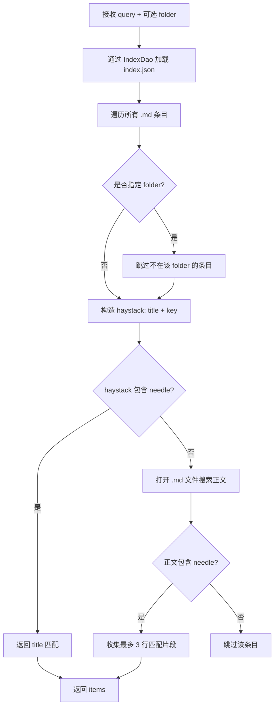
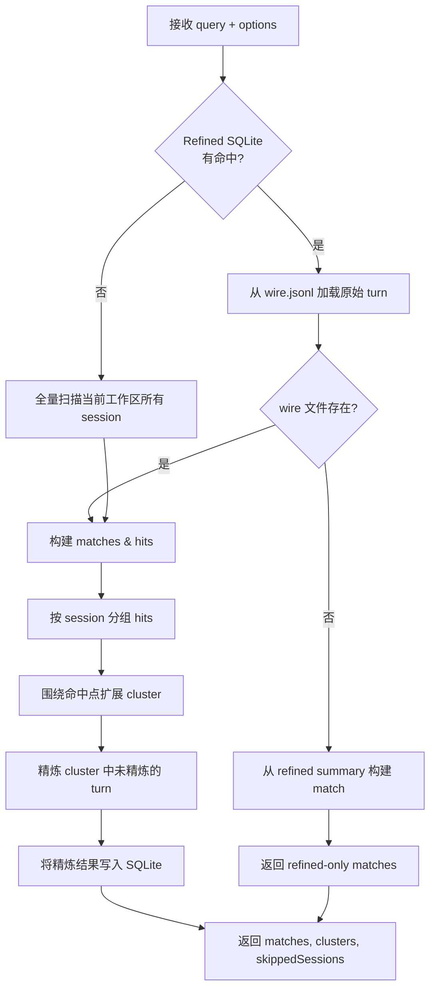

# 搜索逻辑

本项目提供两个搜索工具，作用域和实现各不相同：

- `search` —— 在持久化的 Markdown 记忆文件中搜索。
- `search_context` —— 在 Kimi Code CLI 的会话 wire（`wire.jsonl`）中搜索。

---

## 1. `search` —— 记忆搜索

源码：`src/tools/memory-tools.ts`（`handleSearch`）

### 流程



### 关键行为

- query 被转小写，与同样小写化的 haystack 做子串匹配。
- 匹配策略是**标题/key 优先，正文兜底**。
- 正文命中时，返回最多 3 行包含关键词的片段。
- 结果没有打分排序，按 `index.json` 的遍历顺序返回。

### 返回示例

```json
{
  "items": [
    {
      "key": "use-sqlite-cache",
      "folder": "memory/decisions",
      "title": "Use SQLite for Cache",
      "matches": ["We chose SQLite over Redis because..."]
    }
  ]
}
```

---

## 2. `search_context` —— 跨会话历史搜索

源码：

- 入口：`src/tools/context-tools.ts`（`handleSearchContext`）
- 核心搜索：`src/context/wire-context.ts`（`searchWireContext`）
- 精炼存储：`src/refined-manager.ts`（`searchRefinedTurns`）

### 流程



### 两阶段搜索

#### 第一阶段 —— Refined SQLite 索引

`searchWireContext` 首先通过 `RefinedManager.searchRefinedTurns` 查询 `refined/refined.sqlite`：

- 把 query 拆成小写关键词。
- 用 SQL `LIKE` 要求所有关键词都匹配 `summary`、`facts`、`notes` 列。
- 按关键词出现频次打分并排序返回。
- 对每个 refined 命中，尝试从对应 session 的 `wire.jsonl` 加载原始 turn。
  - 如果 wire 仍存在，使用完整 turn 内容构建 match，并作为 hit 参与 cluster 扩展。
  - 如果 wire 已不存在，直接用 refined 记录本身作为 match 返回。其 `summary` 会作为 `agent` 文本和 `snippet`，即使没有原始 wire，关键信息也不会丢失。
  - 如果有命中，直接返回，不再走全量扫描。

#### 第二阶段 —— 全量 wire 扫描兜底

如果 refined 搜索没有结果，`searchWireContext` 会回退到扫描当前工作区的所有 session：

- `findAllWorkspaceSessions()` 发现当前工作区的所有 `wire.jsonl`。
- 逐个解析为 turns。
- 对每个 turn 的 `user` + `agentText` 做关键词打分。
- 命中的 turns 成为 hits。

### 聚类与精炼

回到 `handleSearchContext`：

1. **按 session 分组 hits**。只有存在 wire 的 hit 才会参与 cluster；纯 refined 命中作为独立结果返回。
2. **扩展 cluster**：对每个命中点，吸收 `cluster_gap_seconds`（默认 90 秒）内的相邻 turn，最多 `max_cluster_size` 个。
3. **精炼缺失 turn**：cluster 中尚未写入 SQLite 的 turn 会批量传给 `refinedManager.refineTurn()` 并保存。
4. **返回** `matches`、`clusters`、`skippedSessions`、`refinedCount`。

### 返回示例

```json
{
  "query": "SQLite cache",
  "totalMatches": 2,
  "matches": [
    { "sessionId": "session_xxx", "turnId": 5, "score": 3, "user": "...", "agent": "..." }
  ],
  "clusters": [
    { "sessionId": "session_xxx", "hitTurnId": 5, "memberCount": 3, "members": [...] }
  ],
  "skippedSessions": [],
  "refinedCount": 1
}
```

---

## 对比

| 维度 | `search` | `search_context` |
|------|----------|------------------|
| 搜索对象 | Markdown 记忆文件 | Kimi Code CLI `wire.jsonl` 会话 |
| 索引 | `index.json` v3-kv | `refined/refined.sqlite` + 全量扫描兜底 |
| 匹配方式 | title/key/正文子串匹配 | refined summary/facts/notes 或 turn 文本子串匹配 |
| 排序 | 无 | 按关键词频次打分排序 |
| 聚类 | 无 | 围绕命中点扩展 cluster |
| 副作用 | 无 | 将精炼 turn 写入 SQLite |

---

## 影响搜索的环境变量

| 变量 | 影响 |
|------|------|
| `MEMORY_STORE_ROOT` | 改变 `index.json` 和 `refined/refined.sqlite` 的位置。 |
| `MEMORY_SESSIONS_ROOT` | 改变 `search_context` 查找 `wire.jsonl` 的位置。 |
| `KIMI_CODE_HOME` | `MEMORY_SESSIONS_ROOT` 的替代方案；会话从 `<KIMI_CODE_HOME>/sessions` 读取。 |
